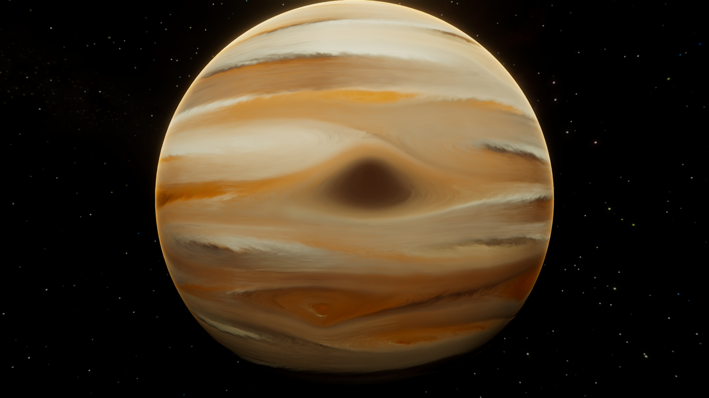
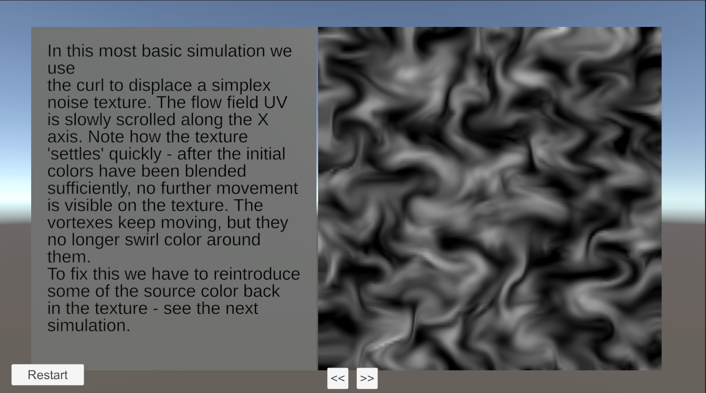
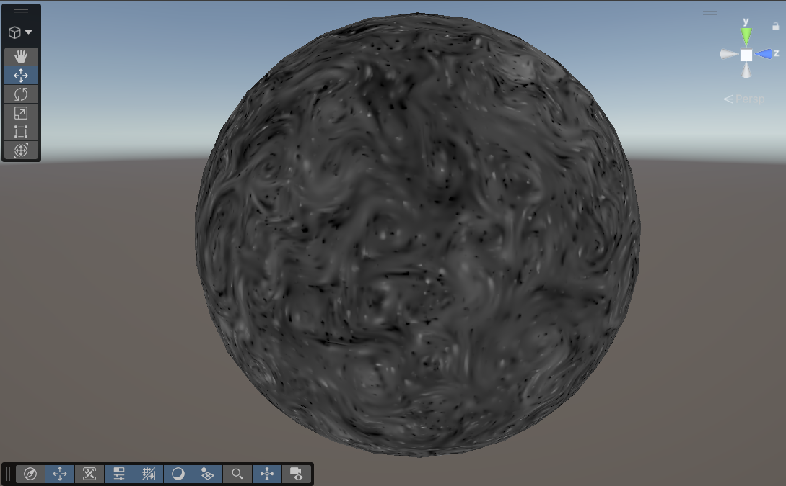
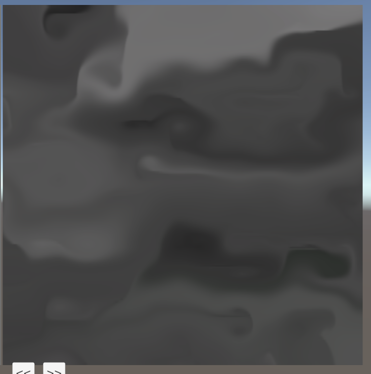
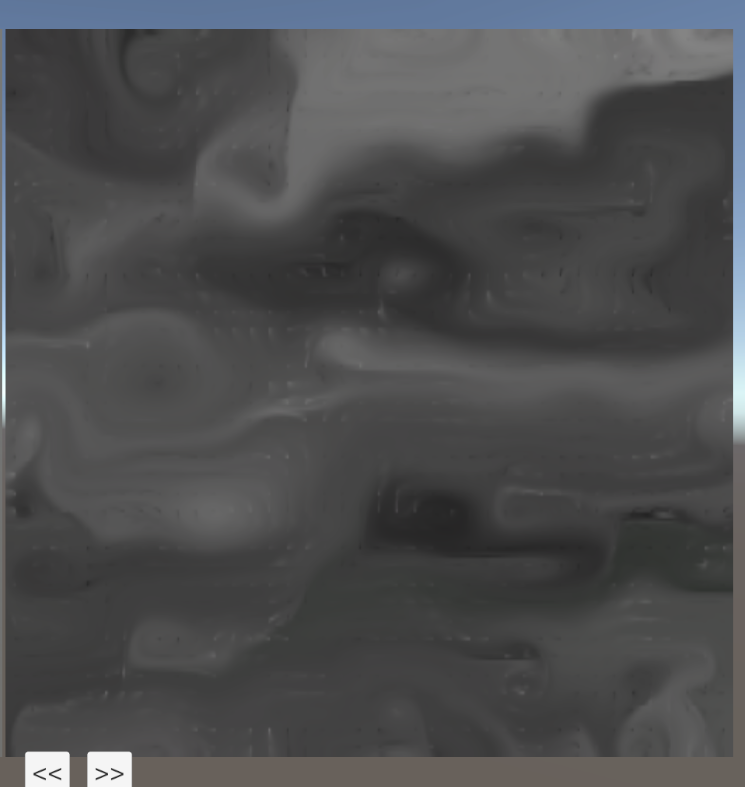
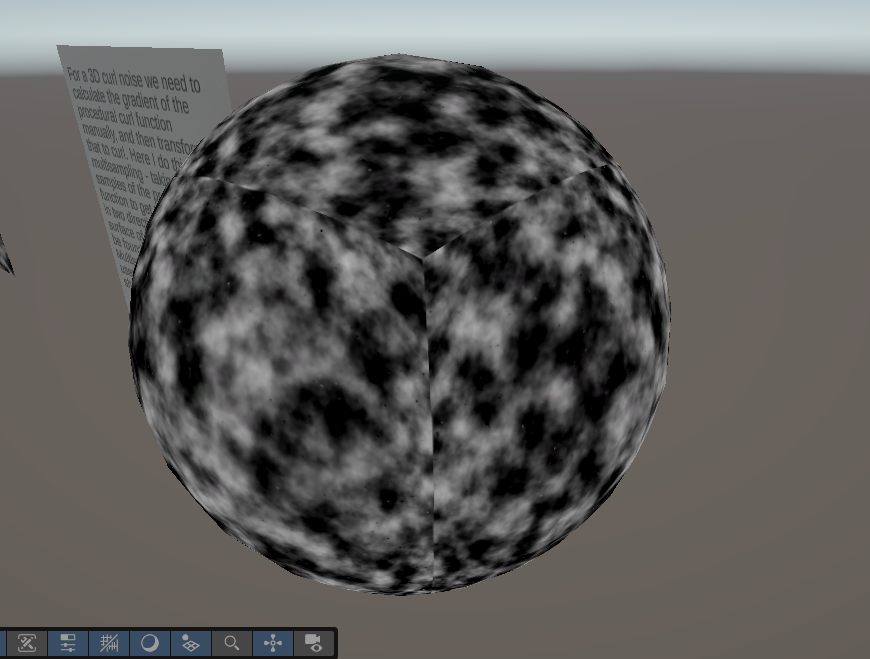

# Flow Simulation

Using curl noise we can simulate natural flow patterns in a way that looks much more natural than layering simplex noise
and other procedural methods. This technique can be used for simulating clouds, smoke, and other fluid-like phenomena in real-time applications.

This technique is used for procedural gas giants in my Unity asset - [Procedural Planet Generation](https://assetstore.unity.com/packages/vfx/shaders/procedural-planet-generation-shaders-in-editor-baking-custom-spa-339842):

This was built thanks to Emil Dziewanowski and Jan Wedekind's articles on the topic:
- https://emildziewanowski.com/flowfields/
- https://www.wedesoft.de/software/2023/03/20/procedural-global-cloud-cover/

To implement this in Unity, we can use Custom Render Textures for the simulation source and Shader Graph to write
a simple shader that calculates curl from procedural noise. This demo project shows a simple 2D curl simulation on
a flat plane, a slightly more complex version that uses color reintroduction to keep the simulation going indefinitely,
and finally a 3D spherical version that maps the curl to a cubemap and then to a sphere.

## Requirements

This project is built with Unity 6000.3.5f2 and URP.

## Custom Render Textures

The basis of the simulation is a Custom Render Texture - this is a special type of texture in Unity that can be updated directly through a shader.
We will run the simulation on it and have a second material that uses that texture to display on an object in our scene.

https://docs.unity3d.com/6000.3/Documentation/ScriptReference/CustomRenderTexture.html

https://docs.unity3d.com/Packages/com.unity.shadergraph@17.0/manual/Custom-Render-Texture.html

Custom Render Textures are different from Render Texture in that they allow us to update a texture directly through a custom shader.
Furthermore, we can set them up to be double-buffered - which means we will be using the texture as both input and output
to our shader.

The size of the texture determines the detail of our simulation and also the performance cost of it. In this project
I'm using 512 resolution for both the 2D and cubemap simulation. For the cubemaps that's 512(x6 faces) pixels to calculate each frame.
For real-time applications I've found this technique to work well at as high as 1024x1024 faces. It's good to note that
the performance cost is not tied to the game resolution - so it works better with 4K than other procedural shader
techniques.

## Curl Noise

We will procedurally generate a flow field for our simulation.
The flow field maps each point on our simulation surface to a direction vector, indicating how particles at that location will be displaced.
And to be more precise, since we aren't using 'particles', but the pixels of a texture, the flow field represents a UV
displacement for each original pixel of the texture in some direction. Performing this displacement each frame creates
an animated effect.

If we just had a random noise displacement field, we would quickly displace all color away from our texture.
For a continuous simulation we need a divergence free flow field - this ensures that the flow is rotational and that 
the color will (mostly) stay inside of the texture. Dziewanowski explains this in depth in his [article](https://emildziewanowski.com/curl-noise/).

Curl can be calculated from any heightmap or procedural noise function, so the beauty of this technique is that
we can quickly experiment with different flow shapes and layers. In our simple example we use simplex noise, 
bright areas of which represent clockwise flow and dark areas represent counterclockwise flow.

Dziewanowski shows us a nice way to get the curl in 2D: We use the derivatives on the noise function to get the rate of change in x and y directions. 
This is the gradient, and we rotate it 90 degrees to get the curl - you can see how it's done in the Curl Flow 2D shader graph. 

### Color Reintroduction
Using only curl to apply rotation is not enough - the colors of the texture will blend together and the simulation
will become static after a while.

Introducing a time-varying movement to the curl field can help with this, but will still lead to the pattern becoming
static after a while.

To keep our simulation going indefinitely we need to sample the source texture each frame and add a small amount of it back
into the simulation:

## 3D Curl on a Sphere
To convert the basic 2D simulation to work on a 3D sphere in Unity is actually quite simple - we can use a cubemap 
Custom Render Texture instead of a 2D one. Then we will use 3D noise functions to get a nice continuous 3D noise over the surface of the sphere.

The key conversion detail is that we need to find the gradient for this 3D noise, and we cannot use DDX and DDY functions anymore - 
they measure the rate of change, aka the gradient, in screen space, and we want the gradient over the surface of the sphere.

One way to do this is to sample the noise function multiple times, at a constant offset across the sphere surface and
calculate the gradient manually. Since we're on the surface of a sphere, it's sufficient to do this in the tangent and
bitangent directions - these represent the local 2D plane of the sphere surface. This is packed into one custom function [here](Assets/CurlFlow/Shaders/3D%20Curl%20on%20Sphere/Multisample3DCurl.hlsl).

There is currently a bug with cube shaped Custom Render Texture where they cannot initialize from cubemaps, so we use
the same 2D noise texture as the source for the simulation. This gets repeated across each face at the start of the 
simulation:

## Editor Utilities

There are some minor utilities in the project to make working with Custom Render Textures easier. A custom
editor for the 'CustomRenderTextureSimulation' component adds the material inspector for the custom render texture shader
in the inspector view, so that you can edit your simulation shader when you select the body that displays the texture through a
display material.

---

If this tutorial was useful to you, and you would like to see more like it, consider supporting me on [Ko-fi](https://ko-fi.com/parallelcascades)

Check out more of my work at [parallelcascades.com](https://parallelcascades.com)
